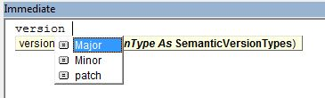

# RT Macros

These are tools that were created to be used by allowance audit and allowance billing teams.
### Authors 
1.      Robert Todar
2.      Nicholas Ackerman

# TABLE OF CONTENTS 
   1. OVERVIEW
   2. CONFIG FILES
   3. FILE LOCATIONS 
   4. Version Control and Distribution
   5. CLAIMS TOOL
   6. TRIBBLE TOOL
   7. BILLING CORRESPONDENCE TOOL
   8. DATABASE CONNECTIONS
   9. SCAN / S2S WORKLIST CHECKOUT
   10. Email Functions 

## Note
(ROBERT)Please note that the code in this workbook is from when I first started to learn to program to a few years of expereince. Unfortunately, this has made it messy and hard to follow at times and I was unable to go back and clean things up ☹
That said, best of luck to those that inherit this mess! 😊

## Overview
 - Most all of the tools are written in VBA and are located in the file `RT_Macros.xlsb`.
 - Each user get's a copy of this workbook saved to `C:\rtmacros` on their local machine.
 - This workbook is hidden by default so it is open in the background after the user runs `RT_Macros_Box` from the command ribbon.

## Config Files
Multiple Config files are used in RT_Macros to ease the modification of data utilized by sections of the applications. Below are the primary config files, locations, and purposes. These files can be modifed carefully by the users to increase functionality or grant access to new users.
- [config.json](config.json) - This contains version numbers and group lists for the three different user groups: stable, insider, and tester. Users can be added or removed inside this file and versions can be updated in this as well. This is the file that each users system will read to check for updates.
- [configClaims.json](sql/Claims/ConfigClaims.json) - This config file is used to modify data in the Claims tool. The Admin are referenced at the top of the document. These users have access to more functions then the standard user. The sections for reasons pacs and reasons wims are used to populate drop down lists. The Email Users and CCEmailusers List field is used to place the users on an email list. The email are pulled from the Users_Emails config file. Finally, at the bottom of the file are tolernaces that are utilized in the program to pull funny pictures if a claim meets the requriemnts. 
- [configTribbler.json](sql/Tribbler/ConfigTribble.json) - This config file is used to modify data in the Tribble tool. Like the CLaims Config file users in the admin section have more functions available than the standard user. The status and issues fields are used to populate dropdown fields in the forms. Finally, there is a bouncer section. This will have to be updated with users if a user is added to the bouncer team.
- [configBC.json](sql/BillingCorrespondence/ConfigBC.json) - This config file is used to modify data in the the Billing Correspondence Tools. This file is used by tools that help the Billing and PreAudit team. The first EmailUsers and ccEmailUsers fields are used by the Open Correspondence tool on the PreAudit Team. The BillerList, BillerListUSRNM, AccountantListUSRNM, and ADMIN_DEV fields are used by a Billing tool. Under the Paybacks section of RT_macros. The CoversheetFields are fixed to a Template Documents that is used to build coversheets for Paybacks. Finally, the fields that are listed at the bottom of this document are used to popualte drop down fields in Excel documents that are outputted by both the Billing and PreAudit Tools.

## Important File Locations 
- [Change LOG](versions) - This file lists the lastest changes made to the RT_Macros and what the change included.
- [Log Files for Reporting](data/Reports/REPORTING.LOG) - This log files is used to see who is currently using the two reports (Claims and Tribbler). 
- [Log Files for Error](data/logs/) - These log files are broken out by month and year. These detail all error messages that users encountered while using RT_Macros
- [Log Files for Usage](data/analytics/) - These are the most important log files because they detail the usage of the RT_Macros. These can be used to run analytics for how open certain fuctions are used. 
- [Log Files for Payback](data/Reports/PAYBACKS.LOG) - This log file is used to record Paybacks that have been submitted into the Billing Correspondence Database. This DB can sometimes crash and when we have to revert to a previous version some of the paybacks are lost. This keeps track of the paybacks so that they can be manually re-entered
- [SQL Files](sql) - This the file location of most of the SQL for the tools. This also contains the sql files for the Billing Correspondence, Tribbler, and Claims tools. These tools have their SQL in their own folders.
- [Claims Archive File](data/Archive/Claims/) - This file contains a Copy of the Claims DB table. This is incase for any reason the table gets deleted. This was created because this tables use to be classified as a "TEMP TABLE". When the data migration to EDM is complete this process can be shutdown. 
- [Tribble Archive File](data/Archive/Tribbler/) - Thie file contains a Copy of the Tribble DB table. This is incase for any reason the table gets deleted. This was created because this tables use to be classified as a "TEMP TABLE". When the data migration to EDM is complete this process can be shutdown. 
- [Users_Emails](data/Users_Emails.json)- This json file contains all of the Users who currently have access to RT_macros and lists their Emails. The emails can then be referenced by other processes in RT-Macros to quickly connect Usernames to contact information.
- [Tribble Email Templates](sql\Tribbler\Email_Templates\) - The Tribbler tool create an Email after a Tribble has been submitted. The email template is pulled from this folder.
- [.env](.env) - This file has only recently been created so it has not been used very much. But is a great place to store variables to be used with the `env` class object in `RT_Macros`. Can be used to change variables in a testing version or a version that is being used by all members.
- [Note.txt](data/Note.txt) - Is the message that will be displayed on the main dashboard at the bottom of `RT_Macros`.
- [bouncerReportEmailer.json](data/bouncerReportEmailer.json) - Email list for the bouncer report that is sent out every week. Array of email addresses.
- [CLAIMS REPORT](data/Reports/Claims_Report.xlsm) - This is a Excel document that contains some graphs and a couple of macros. This is used by the auditors to track their Claims progress over the course of the year.I would like to replace this with a PowerBI report once we have access to more Enterprise data solutions.
- [TRIBBLE REPORT](data/Reports/Tribble_Report.xlsm) - This is an Excel document that contains graphs and macros. It is used by auditors to track their progress as they submit Tribbles over the course of the year. I once again would like to replace it with a PowerBI report.
- [Placement Emails](data/PlacementEmails) - These emails are for a placement email process. These three templates are used by the tool to prepopulate an Outlook email.
- [ALL PUBLIC FUNCTIONS](data/Archive/PUBLIC_FUNCTIONS_SUBS.LOG) - This file details all of the public functions in RT Macros. IT can be refreshed by running the module `CreateListOfPUBLICFunctionsAndSubs`

## Version Control and Distribution
These are the instructions to save updates made to the code and optionally push out the update to users.

### How it works?
Every time a user opens up the main form in RT_Macros it call a global function `CheckForUpdates`. This function reads a config file and get's the current version that users should be on and compares it to the version they are currently using. If they do not match then the updated version is then copied over from the shared folder into the users own folder (`C:\rtmacros`).

### How to Save updates?

In the the VBE (visual basic editor) immediate window, type in `Version` and provide what type of update it is `major|minor|patch`. This will update the variable `VersionNumber` and increment it based on [semantic versioning](https://semver.org/) and save that version to the [shared folder](versions) using the format `x.x.x RT_Macros.xlsb`.
 1. In the immeidate window type in `Version` and if the update is a `Major`, `Minor`, or a `Patch`

 2. Type in `SaveUpdatedVersion` into the immediate Window. Place your Cursor within the Private Sub `Private Sub SaveUpdatedVersion()` under the `Version Control Module`. Then Press `F5`
 3. First a box will ask for the `Change Notes`. Type in a short summary and press `OK`. The box below will then appear where you can decide if you want to push out the updates to `ALL Users`, `Testers & Insiders`, or `Insiders Only`. 

`NOTE:` - By default it will then open a prompt to see if you want to push updates to any user group. Insiders are usually just the developers while Testers are defined in the `config.json` file

### Fallback Update
If you need to fallback to a past update. Open the `config.json` file and move the version number back to a stable version. `[WARNING: This will overwrite any changes you have made since if you are not careful]` 

### Adding New Users 
- Tool on the Misc Screen For adding More Users. Also Reference how the roles can be updated if needed.

## CLAIMS TOOL
 - The Claims tool is a process to save/record audit finds that have been billed or resulted in an audit dollar recovery. The tool pulls information from CABS and DB2. This information is than manipulated by the auditor to include additional fields. The claim is than submitted to a Snowflake table. Users can be added manually to this tool by adding their usernames to the ConfigClaimsfile
 - The claims tool additionally has an archive process to save the information that is being stored in Snowflake. The data is stored in a CSV file. Eventually, this is going to need to be retired because the new tables in the EDM environemnt will be fixed and are not at risk of being deleted.
 - Claims Tables 
    Version 2 = `"DW_PRD"."TEMP_TABLES"."PA_CLAIMS_CLONE"`
 

## TRIBBLE TOOL
- The Tribble tool is a complex user interface. Below are images of the main and detail screen. These are the primary screens, but there are also screens for filtering results and a screen for updating notes. A user builds a tribble on the details screen and then can continue to acces the tribble to make updated by selecting it from the main screen. After a tribble is created a email is generated using templates and sent to the PreAudit Requests mailbox. Users can be added manually to this tool by adding their usernames to the ConfigTribble file
- Tribble Tables
     `"DW_PRD"."TEMP_TABLES"."PA_TRIBBLES"` for the primary data
     `"DW_PRD"."TEMP_TABLES"."PA_TRIBBLES_CICS"` to store CIC information

## BILLING CORRESPONDENCE TOOL
- This tools contains two parts. The first is a connection to the Open Correspondence Excel File. For these functions to be activated the user must have the Open Correspondence Excel sheet open. Once this is open the user can use the the Pull Open Payabcks tool shown below to pull in the the Open Paybacks from the Billing Correspondence Access DB. This tool runs a query that is held in the SQL Billing Correspondence folder.

 - After the users have compelted the modifications on the Open Correspondence Sheet and want to update the Billing Correspodnence Access DB they can utilize the tool below. This will update all of the records on the open Excel sheet. This is the most unique function for the tools because the update function is not a fixed query that is stored in the SQL folder. Instead these tools require that the headers on the first row of the excel file to be the same as the fields in the Access DB. Additionally, the tool requires that the Invoice# field be present before activating this function. The tool builds a query based off of the columns that exist in the Excel document. 

- The second tool that is available uses the same set of functions is the Billing Paybacks tool. It can be accessed in RT_Macros below. This will populate a GUI asking some questions before outputting results. 

- This is the GUI for the Billing Paybacks tool. This tool runs a query that is held in the SQL Billing Correspondence folder. A different query is accessed depeneidng on what the user selects. After the Biller has completed their tasks they can then use the UPDATE_BC function shown above to update the results with the Billing Correspodence Access DB. This tool also can be modfied by making changes to it configuration file stored in the Billing Correspodnence SQL folder

- `NOTE` - This tool can be used very carefully if you understand how it functions to make massive updates to the Billing Correspondence database. If you know the invoices that you would like to be updated and the column names in the Access DB you can make a file that contains this information and run the Update function. `BE VERY CAREFUL!!!!!!`
- Additionallly, the update function will overwrite the existing data for the fields supplied. If two users have the same worklist at the same time with the same invoices, whoever updates the Billing Correspondence database last will be the what ius displayed in the Database. `CAREFUL FOR POTENTIAL OVERWRITING!!!!!`

## DATABASE CONNECTIONS
- Snowflake Connection String - 
- Snowflake Connection String EDM - 
- DB2 Connection String -
- CABS Connection String - 

These connection strings will not really be needed since all of the helper functions to make a connection have been completed. These functions can be accessed in the `SQL Connection` Module or using the `DB2 Object`
 - QueryCABS
 - QuerySnowFlakeEDM
 - QuerySnowFlake
 - DB2.RunQuery()
 - RunQuery `(USE THIS IF YOU SEND IT THE CONNECTION STRING)`
 - ImportCABSTable - Will import the results of a select query into a workbook
 - ImportSnowflakeTable - Will import the results of a select query from CABS into a workbook

## SCAN / S2S WORKLIST CHECKOUT
- This is a realativly new function. The purpose will be to incorperate it into the Audit process. Letters can be checked out by users. The tool pulls both SCAN and S2S offers. The data is pre calcualted and the output of the offers is into EXCEL. The tool has a few functions that can be used. Users can look up specific offer numbers by using the list function. However, they can also check out a worklist, by selecting a letter and entering a date before pressing Worklist. The process might take a minute or two because it is complex query. The query is stored in the SQL folder.

 ## Email Functions 
 - The two functions below were created to quickly populate emails that are sent out on a regular basis. These functions can be attached to the Quick Access Bar so that they can be accessed without having open the VBA. To do this first activate RT_Macros. Then open the Quick Access Bar and append the two functions below to the ribbon. The users who this email is sent too can be modified in the config files. The ensure that the user has access to RT-Macros and their username and email are added to the proper config files
 - `TommorrowIs Email` - This used to produce an email to the team for the largest claims submitted for the current day. 
 - `OpenPaybacksEmail` - This email is used in conjunction with the Open Correspondence Excel sheet. 

 ## Install Script DC and RT MACROS
 - [INSTALL_DC_MACROS](AA/BILLING/First Time Setup/Scripts/Allowance Billing Tools - Factory Reset.bat)
 - [INSTALL_RT_MACROS](K:/AA/BILLING/First Time Setup/Scripts/PreAudit/Install RT_Macros.vbs)
 - [INSTALL_RT_DC_MACROS](K:/AA/rtmacrosshared/Install DC & RT MACROS)

- The last install option can be used to re-install either of the tools if needed. `UPDATED(01/27/2022)`
## ADDITIONAL FUNCTIONS 
- Additionally there are a list of general functions that be used to improve automation of tasks. Most of these functions can be found in the `General Tools` module. Other public functions are scattered in other modules that can be utlized.
1.  CHECK IF CABS OR PACS - `GeneralTools.IsCABSorPACS` - This accepts an offernumber and then runs a query to determine if that offer number resides in CABS or in PACS.
2. RANDOM_PICTURE - `GeneralTools.SurpriseFormRandomPicture` This popualted an image of a random picture choosen from the images file folder in rt macros. Currently, this is used int the Claims tool if an auditor submits a claim above a specific tolerance.
3.  API tools - This is the APIFUNCTIONS class. This module will be expanded and used more in the future when Bluezone is migrated to a web version. Currently, there are examples for accessing the CABS API. This tool used an MSXML2.XMLHTTP60 library to make HTTP request with the browser. These tools can be used in conjunction with the JSON modules. All of the return results are in a JSON format. 
5.  JSON tools - These tools were primarily sourced from the internet and resource articles. These function are used to parse JSON return strings from API calls. 
6.  Materialize - This a class based function that is used to build forms in VBA. These allows for the user to code more of the styles directly into the form rather than stylizing the form in the Developer Windows. SINGLE LIST form is a good example of where this tool is utilized.
7.  BlueZone Class - This is an important class that is used by many different functions and will be used until Bluezone is transitioned to the Web browser after project METRIC. This class is first initalized and then the user has the ability to SEND KEYS to place information directly into the MainFrame window. The user can interact with the function in the MainFrame window by using the cordinates for specific locations on the screen. This is possible since the windows do not change very often in the MainFrame. 

